# Reconstructions of Droughts in Germany since 1500

[](https://www.zenodo.org/badge/latestdoi/206506760)

[DOI:10.5281/zenodo.3401535](https://doi.org/10.5281/zenodo.3401535)

[DOI:10.5194/cp-2019-104](https://doi.org/10.5194/cp-2019-104)

The present code deals with the reconstruction of drought time series in Germany since 1500. The reconstructions are based on written records from the historical climate and environmental database tambora.org, early and official instrument data as well as precipitation and temperature indices.

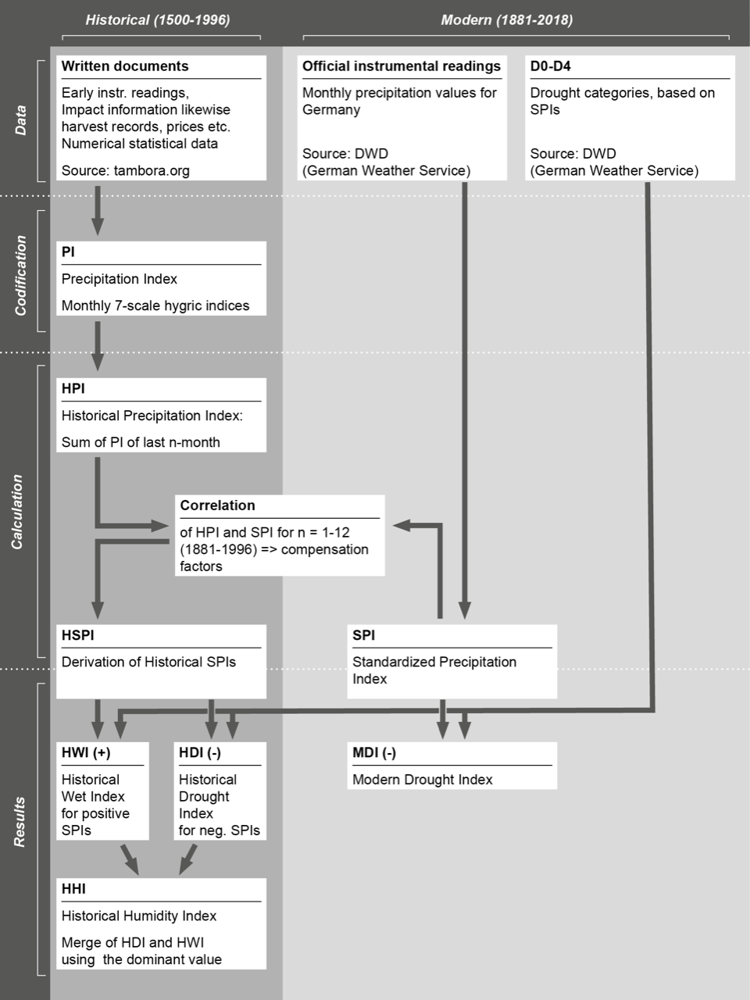


```r
do_fft <- function(pic, filterYears) {
  len <- length(pic)
  ## mirror pic
  pic <- append(pic, pic)
  for(i in 1:len) {
    pic[i+len] <- pic[1+len-i]
  }
  frq <- fft(pic, inverse = FALSE)
  frq1 <- frq
  start = round(len/(12*filterYears)) ## monthly
  stop  = round(2*len-start)
  frq1[start:stop] <- 0.0 
  pic1 <- Re(fft(frq1, inverse = TRUE)/length(frq1))
  pic1 <- pic1[1:len]
  return(pic1)
}

currentYear <- strtoi(substr(Sys.Date(),1,4))
endYear <- ceiling(currentYear/10.0)*10.0
```

 


## Visualize tambora.org data related to droughts


```r
require("ggplot2")
```

```
## Loading required package: ggplot2
```

```r
require("extrafont")
```

```
## Loading required package: extrafont
```

```
## Warning in library(package, lib.loc = lib.loc, character.only = TRUE,
## logical.return = TRUE, : there is no package called 'extrafont'
```

```r
require("ggmap")
```

```
## Loading required package: ggmap
```

```
## Warning in library(package, lib.loc = lib.loc, character.only = TRUE,
## logical.return = TRUE, : there is no package called 'ggmap'
```

```r
#require("rnaturalearth")
#require("rnaturalearthdata")
#require("sf")
#require("scales")


grp_de <- read.csv("csv/tmb_all_geo_de_grouped.csv", sep=";") 
grp_d_de <- read.csv("csv/tmb_duerre_geo_de_grouped.csv", sep=";") 

mapWorld <- borders("world", colour="#000000", fill="#CFCCCC", xlim = c(10, 11), ylim = c(50, 51))

mp <- ggplot() +   mapWorld
mp <- mp +
  geom_point(aes(x=grp_de$longitude, y=grp_de$latitude, size=(grp_de$count), color="All"), alpha=0.4, shape=20)+
  geom_point(aes(x=grp_d_de$longitude, y=grp_d_de$latitude, size=(grp_d_de$count), color="Drought"), alpha=0.7, shape=20)+
  scale_size_area(trans="sqrt") + 
  labs(fill="")+
  #theme_classic() +
  theme_classic(base_size=80) +
  xlab("Longitude") + ylab("Latitude") +
  guides(colour = guide_legend(override.aes = list(size=40))) +
  scale_x_continuous(limits=c(5,16), breaks=c(6,8,10,12,14)) +  
  scale_y_continuous(limits=c(47,55), breaks=c(48,50,52,54)) +
  
  scale_color_manual(
    name = "Type", 
    labels = c("All", "Drought"),
    breaks  = c("All", "Drought"),
    values = c("All"="#5555FF", "Drought"="#FF5555")              
    ) +
   scale_size_continuous( range = c(20, 100), breaks=c(100,500,1000,5000,10000), name="Count")
```

```
## Scale for 'size' is already present. Adding another scale for 'size', which
## will replace the existing scale.
```

```r
mp  
```

```
## Warning: Removed 128 rows containing missing values (geom_point).
```

```
## Warning: Removed 11 rows containing missing values (geom_point).
```

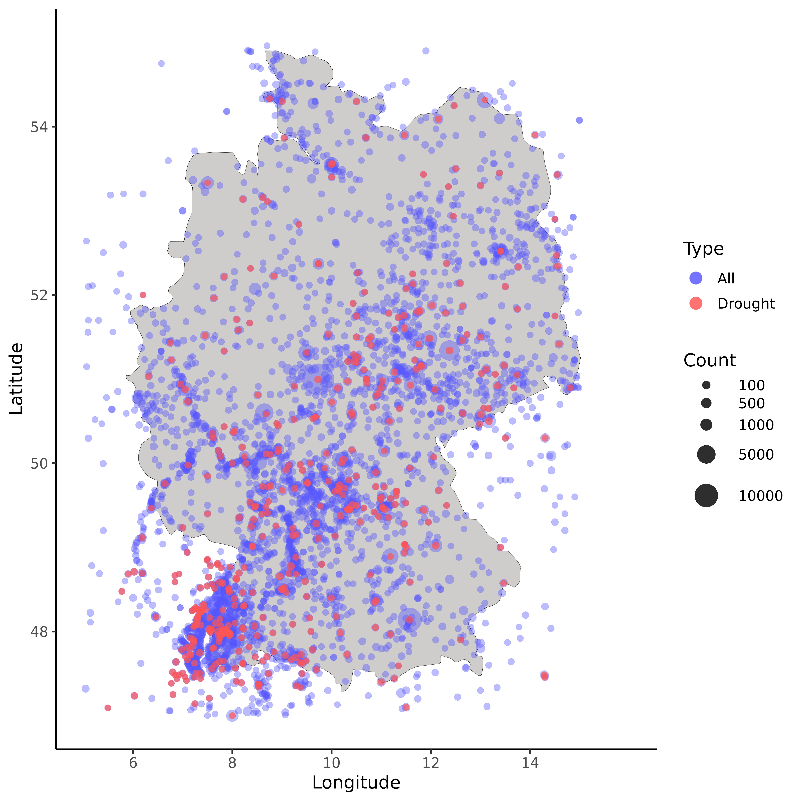<!-- -->

## Load and Visialize Monthly Precipitation Data (PI)


```r
tempCompl <- read.csv("https://raw.githubusercontent.com/climdata/glaser2010/master/csv/ti_1500_2xxx_monthly.csv", sep=",", na = "NA")
tempFull <- tempCompl[,c("year","month","ti")]
precCompl <- read.csv("https://raw.githubusercontent.com/climdata/glaser2019/master/csv/pi_1500_2xxx_monthly.csv", sep=",", na = "NA")
precFull <- precCompl[,c("year","month","pi")]
spifull <- read.csv("https://raw.githubusercontent.com/climdata/dwdSPI/master/csv/spi_de.csv", sep=",", na = "NA")
#precCompl <- distinct(precCompl, year,month, .keep_all= TRUE)
spinew <- subset(spifull, spifull$ts>max(precCompl$ts))
spinew <- spinew[, c("year","month","ts","time","spi1")]
names(spinew)[names(spinew) == 'spi1'] <- 'pi'
spinew <- spinew[order(spinew$ts),]
### Limit range
for(i in length(spinew$pi)) {
  if(spinew$pi[i] > 3.0) {
    spinew$pi[i] = 3.0
  }
  if(spinew$pi[i] < -3.0) {
    spinew$pi[i] = -3.0
  }  
}
p1 <- rbind(precCompl, spinew)
p1 <- p1[order(p1$ts),]
mp <- ggplot(p1, aes(year, month))
mp + geom_raster(aes(fill=pi))+
  theme_classic(base_size=80) +
  #theme_classic() +
  labs(x="Year", y="Month", title="", subtitle="") +
  scale_y_continuous(breaks=c(1,6,12))+
  scale_x_continuous(limits=c(1500,endYear)) +  
  scale_fill_gradient2(low="#AA6010", mid="#FCF0C2", high="#23AB30",
                       limits=c(-3,3)) +
  theme( legend.key.width = unit(2,"cm")) +
  guides(fill=guide_legend(title="PI", reverse = TRUE))  
```

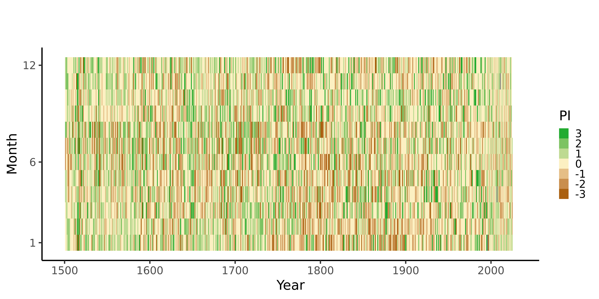<!-- -->

## Visialize Monthly Temperature Data (TI)


```r
require("ggplot2")
library("RColorBrewer")

tempColors = rev(brewer.pal(n = 9, name = "RdBu"))

t1 <- tempCompl
t1 <- t1[order(p1$ts),]
mp <- ggplot(t1, aes(year, month))
mp + geom_raster(aes(fill=ti))+
  theme_classic(base_size=80) +
  #theme_classic() +
  labs(x="Year", y="Month", title="", subtitle="") +
  scale_y_continuous(breaks=c(1,6,12))+
  scale_x_continuous(limits=c(1500,endYear)) +  
  scale_fill_gradientn(colors=tempColors) + 
  theme( legend.key.width = unit(2,"cm")) +
  guides(fill=guide_legend(title="TI", reverse = TRUE))  
```

```
## Warning: Removed 266 rows containing missing values (geom_raster).
```

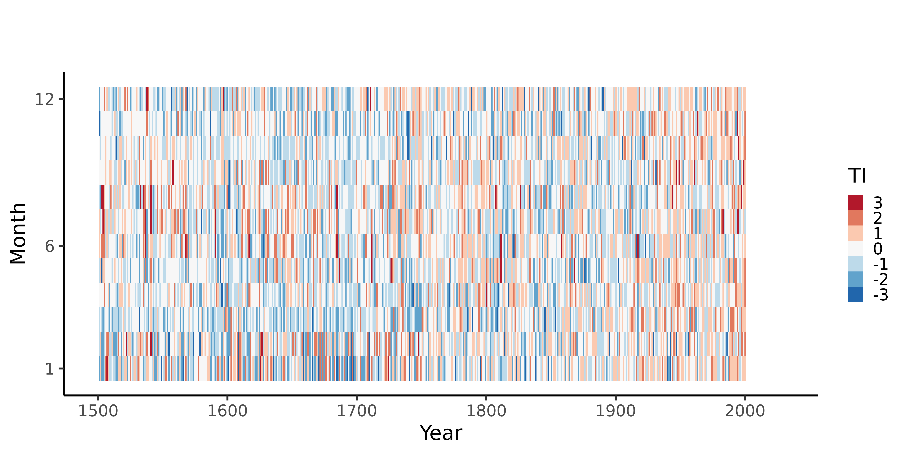<!-- -->

## Calibration Historical Precipitation Index (HPI) vs Standard Precipitation Index (SPI)


```r
library(zoo)
```

```
## 
## Attaching package: 'zoo'
```

```
## The following objects are masked from 'package:base':
## 
##     as.Date, as.Date.numeric
```

```r
library("ggplot2")
library(gridExtra)
library(grid)
library(qdapTools)
spiCal <- subset(spifull, spifull$year>1880 & spifull$year<1996)
spiCal <- spiCal[order(spiCal$ts),]

hi <- precCompl
hi$hdi1 <- hi$pi
hi <- hi[order(hi$ts),]
prev <- hi$hdi1
for (m in c(2,3,4,5,6,7,8,9,10,11,12)) {
  column <- paste("hdi", m, sep="")
  hdi <- rollapply(hi$pi, width=m, by=1, FUN=sum)
  hi$hdi <- prev
  hi$hdi[m:length(hi$hdi)] <- hdi
  prev <- hi$hdi
  names(hi)[names(hi) == 'hdi'] <- column
}
hiCal <- subset(hi, hi$year>1880 & hi$year<1996)
hdispi <- merge(hiCal,spiCal, by=c("year","month"))

plots <-  list()
slopes <- list()
offsets <- list()
#par(mfrow=c(3,4))
for (m in c(1:12)) {
  yBreaks <-c(-15,-10,-5,0,5,10,15)
  if(m==1) {
    yBreaks <-c(-3,-2,-1,0,1,2,3)
  }
  hdiCol <- paste("hdi", m, sep="")
  spiCol <- paste("spi", m, sep="")
  df <- data.frame(y = hdispi[,hdiCol], x = hdispi[,spiCol])
  df <- subset(df, !is.na(df$x))
  mx <- lm(y ~ x, df);  
  slope <- unname(coef(mx)[2])
  offset <- unname(coef(mx)[1])
  
  predx <- seq(-3, +3, len=50)
  pred <- predict(mx, newdata=list(x=predx), se.fit=TRUE)  
  
  eq <- substitute(italic(y) == a + b %.% italic(x)*","~~italic(r)^2~"="~r2, 
                   list(a = format(unname(coef(mx)[1]), digits = 3),
                        b = format(unname(coef(mx)[2]), digits = 5),
                        r2 = format(summary(mx)$r.squared, digits = 3)))
  eq <- as.character(as.expression(eq))
  p <- ggplot(data = df, aes(x = x, y = y)) +
    theme_classic(base_size=60) +
    #theme_classic(base_size=5) +
    scale_x_continuous(breaks=c(-3,-2,-1,0,1,2,3), limits=c(-3.5,3.5)) +
    scale_y_continuous(breaks=yBreaks) +
    geom_hline(aes(yintercept=0)) +
    geom_vline(aes(xintercept=0)) +
    labs(x=toupper(spiCol), y=toupper(hdiCol), title="", subtitle="") +
    geom_smooth(method = "lm", se=TRUE, color="cyan", formula = y ~ x) +
    geom_point(color="#0000AA", alpha=0.3, size=5) +
    geom_text(x = 1.4, y = -3*slope, label = eq, parse = TRUE, size=15)
    #geom_point(color="#0000AA", alpha=0.3, size=0.3) +
    #geom_text(x = 1.0, y = -3*slope, label = eq, parse = TRUE, size=2)
  plots[[length(plots) + 1]] <- p
  slopes[[length(slopes) + 1]] <- slope
  offsets[[length(offsets)+ 1]] <- offset
}
margin = theme(plot.margin = unit(c(1,1,1,1), "mm"))
p <- grid.arrange(grobs = lapply(plots, "+", margin), nrow=4)
```

```
## Warning: Removed 4 rows containing non-finite values (stat_smooth).
```

```
## Warning: Removed 4 rows containing missing values (geom_point).
```

```
## Warning: Removed 2 rows containing non-finite values (stat_smooth).
```

```
## Warning: Removed 2 rows containing missing values (geom_point).
```

```
## Warning: Removed 1 rows containing non-finite values (stat_smooth).
```

```
## Warning: Removed 1 rows containing missing values (geom_point).
```

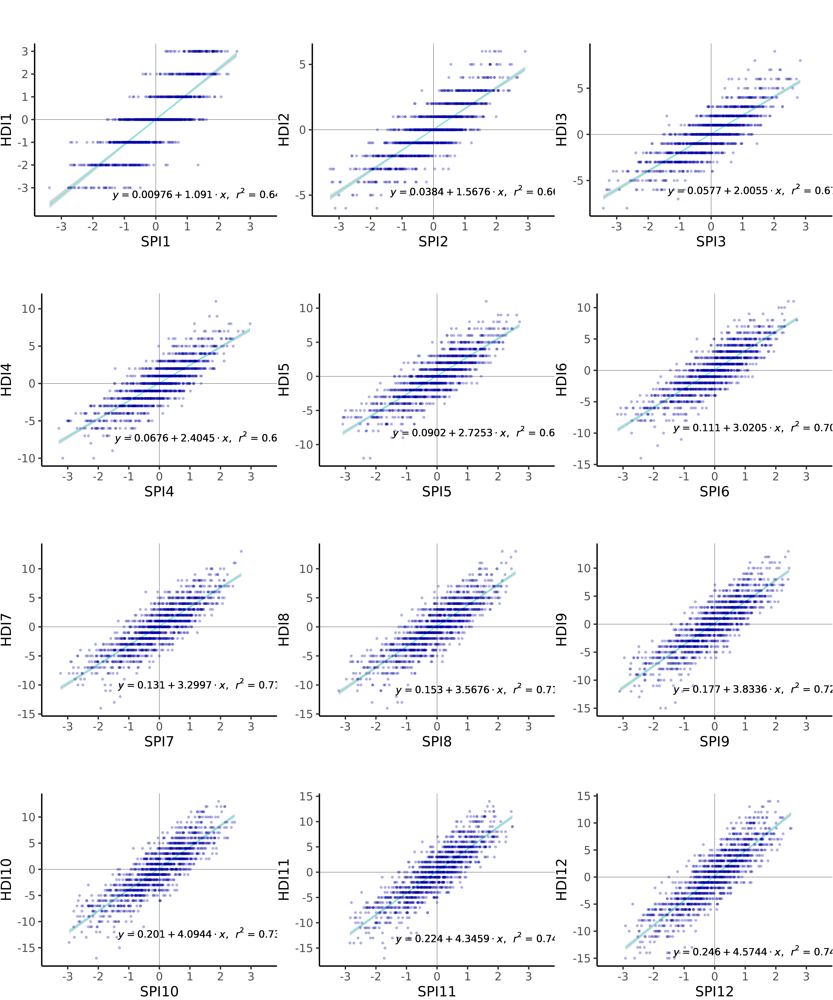<!-- -->

```r
##plots[11]
```
## Duration and scale factors of the relationship between SPI and HPI


```r
df <- list2df(slopes, col1="y")
df$x <- c(1:12)
mx <- lm(log(df$y) ~ log(df$x), df)
pred <- predict(mx, se.fit=TRUE)
aSlope <- exp(unname(coef(mx)[1]))
bSlope <- unname(coef(mx)[2])

eq <- substitute(italic(slope) == a %.% italic(months)^b*","~~italic(r)^2~"="~r2, 
                 list(a = format(exp(unname(coef(mx)[1])), digits = 4),
                      b = format(unname(coef(mx)[2]), digits = 4),
                      r2 = format(summary(mx)$r.squared, digits = 4)))
eq <- as.character(as.expression(eq))
p <- ggplot(data = df, aes(x = x, y = y)) +
  theme_classic(base_size=80) +
  #theme_classic() +
  labs(x="Months", y="Slope", title="", subtitle="") +
  geom_path(x=df$x, y=exp(pred$fit+2*pred$se.fit), color='#0088bb', lwd=2) +
  geom_path(x=df$x, y=exp(pred$fit-2*pred$se.fit), color='#0088bb', lwd=2) +
  geom_path(x=df$x, y=exp(pred$fit+0*pred$se.fit), color='#0000AA', lwd=3.5) +
  geom_point(color="#0000AA", size=25) + geom_text(x = 8, y = 2, label = eq, parse = TRUE, size=50)
  #geom_point(color="#0000AA", size=2) + geom_text(x = 8, y = 2, label = eq, parse = TRUE, size=5)
p
```

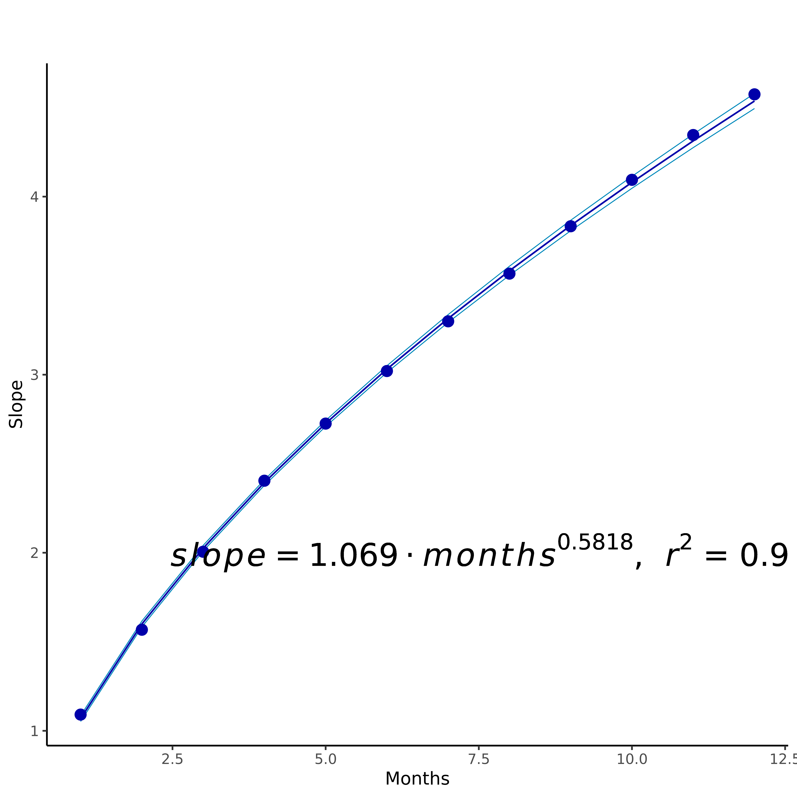<!-- -->


## Duration and scale factors of the relationship between SPI and HPI


```r
df <- list2df(offsets, col1="y")
df$x <- c(1:12)
mx <- lm(df$y ~ df$x, df)
pred <- predict(mx, se.fit=TRUE)
bOffset <- unname(coef(mx)[2])

eq <- substitute(italic(offset) == a + b %.% italic(months)*","~~italic(r)^2~"="~r2, 
                 list(a = format(unname(coef(mx)[1]), digits = 4),
                      b = format(unname(coef(mx)[2]), digits = 4),
                      r2 = format(summary(mx)$r.squared, digits = 4)))
eq <- as.character(as.expression(eq))
p <- ggplot(data = df, aes(x = x, y = y)) +
  theme_classic(base_size=80) +
  #theme_classic() +
  labs(x="Months", y="Slope", title="", subtitle="") +
  geom_path(x=df$x, y=pred$fit+2*pred$se.fit, color='#0088bb', lwd=2) +
  geom_path(x=df$x, y=pred$fit-2*pred$se.fit, color='#0088bb', lwd=2) +
  geom_path(x=df$x, y=pred$fit+0*pred$se.fit, color='#0000AA', lwd=3.5) +
  geom_point(color="#0000AA", size=25) + geom_text(x = 8, y = 2, label = eq, parse = TRUE, size=50)
  #geom_point(color="#0000AA", size=2) + geom_text(x = 8, y = 0.05, label = eq, parse = TRUE, size=5)
p
```

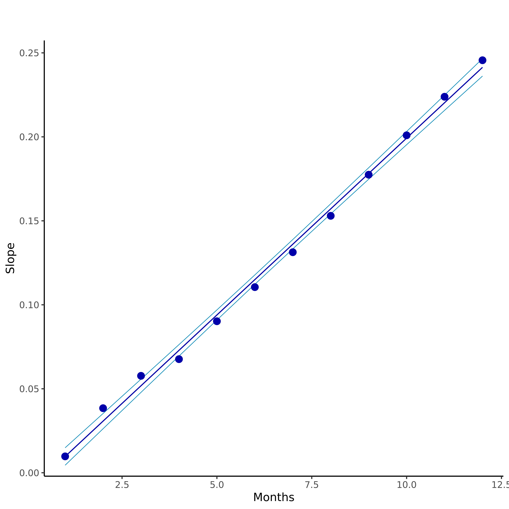<!-- -->


## Calculate SPI from HPI for 1500-xxxx


```r
hspi <- hi[,c('year','month','time', 'ts')]
for (m in c(1:12)) {
  hdiCol <- paste("hdi", m, sep="")
  spiCol <- paste("spi", m, sep="")
  spi <- hi[,hdiCol] * m^(-1/sqrt(3.0))
  # more exact reconstruction
  spi <- (hi[,hdiCol] - bOffset * m)  / (aSlope * m^bSlope)
  hspi$spi <- round(spi, digits=6)
  names(hspi)[names(hspi) == 'spi'] <- spiCol
}
## Add rezent spi data 
spinew <- subset(spifull, spifull$ts>max(hspi$ts))
hspi <- rbind(hspi, spinew)
write.table(hspi, file = "csv/spi_1500_2xxx.csv", append = FALSE, quote = TRUE, sep = ",",
            eol = "\n", na = "NA", dec = ".", row.names = FALSE,
            col.names = TRUE, qmethod = "escape", fileEncoding = "UTF-8")
```


## Plot SPI for 1500-2xxx


```r
mp1 <- ggplot(hspi, aes()) +
  theme_classic(base_size=80) +
  #theme_classic() +
  #coord_cartesian(ylim=c(0,300)) +
  labs(x="Year", y="HSPI", title="", subtitle="") +
  geom_hline(aes(yintercept=0)) +
  geom_line(aes(y=hspi$spi3, x=hspi$ts, color="HSPI03"), size=2.5) +
  geom_line(aes(y=hspi$spi6, x=hspi$ts, color="HSPI06"), size=2.5) +
  geom_line(aes(y=hspi$spi12, x=hspi$ts, color="HSPI12"), size=2.5) +
  scale_color_manual(
    name = "", 
    labels = c("HSPI3", "HSPI6", "HSPI12"),
    breaks  = c("HSPI03", "HSPI06", "HSPI12"),
    values = c("HSPI03"="#33ddff", "HSPI06"="#0088bb","HSPI12"="#003344")
  ) + 
  #guides(linetype = guide_legend(override.aes = list(size = 6))) +
  theme( legend.key.width = unit(2,"cm")) 
mp1
```

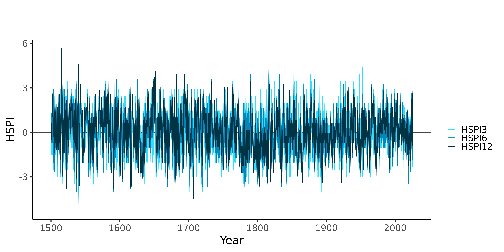<!-- -->

## Calculate Historical Drought Index(HDI) and Modern Drought Index (MDI)


```r
extremeLimit <- 4.0  ## goes up to 5

hiFull <- hspi
## Modern Drought Index MDI
spiCal$mdi1 <- spiCal$spi1
spiCal$mdi2 <- spiCal$spi2
spiCal$mdi3 <- spiCal$spi3
spiCal$mdi4 <- spiCal$spi4
spiCal$mdi5 <- spiCal$spi5
spiCal$mdi <- spiCal$spi12 
for(i in 1:nrow(spiCal)) {
  spiCal$mdi1[i] <- max(-1.0,min(spiCal$spi1[i], spiCal$spi2[i], 0.0, na.rm = TRUE))
  spiCal$mdi2[i] <- max(-1.5,min(spiCal$spi1[i], spiCal$spi2[i], 1.0, na.rm = TRUE))
  if (spiCal$mdi2[i]>-1.0) {spiCal$mdi2[i] = 0.0}
  spiCal$mdi3[i] <- max(-2.0,min(spiCal$spi2[i], spiCal$spi3[i], spiCal$spi4[i], 1.0, na.rm = TRUE))
  if (spiCal$mdi3[i]>-1.5) {spiCal$mdi3[i] = 0.0}  
  spiCal$mdi4[i] <- max(-3.0,min(spiCal$spi4[i], spiCal$spi5[i], spiCal$spi6[i],spiCal$spi7[i], spiCal$spi8[i], spiCal$spi9[i],spiCal$spi10[i], 1.0, na.rm = TRUE))
  if (spiCal$mdi4[i]>-2.0) {spiCal$mdi4[i] = 0.0}
  
  spiCal$mdi5[i] <- max(-extremeLimit,min(spiCal$spi10[i], spiCal$spi11[i], spiCal$spi12[i], 1.0, na.rm = TRUE))
  if (spiCal$mdi5[i]>-3.0) {spiCal$mdi5[i] = 0.0}   
  spiCal$mdi[i] <- min(spiCal$mdi1[i],spiCal$mdi2[i],spiCal$mdi3[i],spiCal$mdi4[i],spiCal$mdi5[i], 0.0, na.rm = TRUE)
}
## Historical Drought Index HDI
hiFull$hdi1 <- hiFull$spi1
hiFull$hdi2 <- hiFull$spi2
hiFull$hdi3 <- hiFull$spi3
hiFull$hdi4 <- hiFull$spi4
hiFull$hdi5 <- hiFull$spi5
hiFull$hdi <- hiFull$spi12 
for(i in 1:nrow(hiFull)) {
  hiFull$hdi1[i] <- max(-1.0,min(hiFull$spi1[i], hiFull$spi2[i], 0.0, na.rm = TRUE))
  
  hiFull$hdi2[i] <- max(-1.5,min(hiFull$spi1[i], hiFull$spi2[i], 1.0, na.rm = TRUE))
  if (hiFull$hdi2[i]>-1.0) {hiFull$hdi2[i] = 0.0}
  
  hiFull$hdi3[i] <- max(-2.0,min(hiFull$spi2[i], hiFull$spi3[i], hiFull$spi4[i], 1.0, na.rm = TRUE))
  if (hiFull$hdi3[i]>-1.5) {hiFull$hdi3[i] = 0.0}  
  
  hiFull$hdi4[i] <- max(-3.0,min(hiFull$spi4[i], hiFull$spi5[i], hiFull$spi6[i],hiFull$spi7[i], hiFull$spi8[i], hiFull$spi9[i],hiFull$spi10[i], 1.0, na.rm = TRUE))
  if (hiFull$hdi4[i]>-2.0) {hiFull$hdi4[i] = 0.0}
  
  hiFull$hdi5[i] <- max(-extremeLimit,min(hiFull$spi10[i], hiFull$spi11[i], hiFull$spi12[i], 1.0, na.rm = TRUE))
  if (hiFull$hdi5[i]>-3.0) {hiFull$hdi5[i] = 0.0}   
  
  hiFull$hdi[i] <- min(hiFull$hdi1[i],hiFull$hdi2[i],hiFull$hdi3[i],hiFull$hdi4[i],hiFull$hdi5[i], 0.0, na.rm = TRUE)
}
## Historical Wet Index HWI
hiFull$hwi1 <- hiFull$spi1
hiFull$hwi2 <- hiFull$spi2
hiFull$hwi3 <- hiFull$spi3
hiFull$hwi4 <- hiFull$spi4
hiFull$hwi5 <- hiFull$spi5
hiFull$hwi <- hiFull$spi12  
hiFull$hdwi <- hiFull$spi12  ## Drought/Wet Index => Difference
hiFull$hhi <- hiFull$spi12  ## Humidity Index  => Maximum Extreme -> Larger Amplitude
for(i in 1:nrow(hiFull)) {
  hiFull$hwi1[i] <- min(1.0,max(hiFull$spi1[i], hiFull$spi2[i], 0.0, na.rm = TRUE))
  
  hiFull$hwi2[i] <- min(1.5,max(hiFull$spi1[i], hiFull$spi2[i], -1.0, na.rm = TRUE))
  if (hiFull$hwi2[i]<1.0) {hiFull$hwi2[i] = 0.0}
  
  hiFull$hwi3[i] <- min(2.0,max(hiFull$spi2[i], hiFull$spi3[i], hiFull$spi4[i], -1.0, na.rm = TRUE))
  if (hiFull$hwi3[i]<1.5) {hiFull$hwi3[i] = 0.0}  
  
  hiFull$hwi4[i] <- min(3.0,max(hiFull$spi4[i], hiFull$spi5[i], hiFull$spi6[i],hiFull$spi7[i], hiFull$spi8[i], hiFull$spi9[i],hiFull$spi10[i], -1.0, na.rm = TRUE))
  if (hiFull$hwi4[i]<2.0) {hiFull$hwi4[i] = 0.0}
  
  hiFull$hwi5[i] <- min(extremeLimit,max(hiFull$spi10[i], hiFull$spi11[i], hiFull$spi12[i], -1.0, na.rm = TRUE))
  if (hiFull$hwi5[i]<3.0) {hiFull$hwi5[i] = 0.0}   
  
  hiFull$hwi[i] <- max(hiFull$hwi1[i],hiFull$hwi2[i],hiFull$hwi3[i],hiFull$hwi4[i],hiFull$hwi5[i], 0.0, na.rm = TRUE)
  hiFull$hdwi[i] <- hiFull$hwi[i] + hiFull$hdi[i]
  if (hiFull$hdwi[i] < 0) {
    hiFull$hhi[i] <- hiFull$hdi[i]
  } else {
    hiFull$hhi[i] <- hiFull$hwi[i]
  }
  
}
hhi <- hiFull[,c('year','month','time', 'ts', 'hdi', 'hwi', 'hhi', 'hdwi')]
hhi$hdi <- round(hhi$hdi, digits=6)
hhi$hwi <- round(hhi$hwi, digits=6)
hhi$hhi <- round(hhi$hhi, digits=6)
hhi$hdwi <- round(hhi$hdwi, digits=6)
write.table(hhi, file = "csv/hhi_1500_2xxx.csv", append = FALSE, quote = TRUE, sep = ",",
            eol = "\n", na = "NA", dec = ".", row.names = FALSE,
            col.names = TRUE, qmethod = "escape", fileEncoding = "UTF-8")
```

## Plot HDI/MDI Calibration


```r
hiCal <- subset(hiFull, hiFull$year>1880 & hiFull$year<1996)
hiCal <- hiCal[order(hiCal$ts),]
df <- data.frame(y = hiCal$hdi, x = spiCal$mdi)
df <- subset(df, !is.na(df$x))
mx <- lm(y ~ x, df);  
eq <- substitute(italic(r)^2~"="~r2, 
                 list(r2 = format(summary(mx)$r.squared, digits = 3)))
eq <- as.character(as.expression(eq))
mp1 <- ggplot() +
  theme_classic(base_size=80) +
  #theme_classic() +
  #coord_cartesian(ylim=c(-4,4)) +
  scale_y_continuous(breaks=c(-3,-2,-1,0,1,2,3), limits=c(-4,4)) +
  labs(x="Year", y="DI", title="", subtitle="") +
  geom_hline(aes(yintercept=0)) +
  geom_line(aes(y=-spiCal$mdi, x=spiCal$ts, color="MDI"), size=2.5) +
  geom_line(aes(y=hiCal$hdi, x=hiCal$ts, color="HDI"), size=2.5) +
  annotate('text', x = 1990, y = 3.0, label = eq, parse = TRUE, size=20) +
  scale_color_manual(
    name = "", 
    labels = c("MDI+", "HDI-"),
    breaks  = c("MDI", "HDI"),
    values = c("MDI"="#33ccff", "HDI"="#ff9933", "black"="#000000")
  ) + 
  theme( legend.key.width = unit(2,"cm")) 
mp1
```

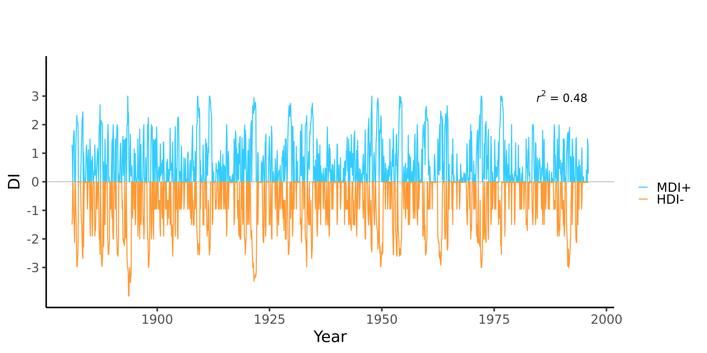<!-- -->

## Calculate Lowpass FFT of HDI & MDI


```r
hiCal2 <- subset(hiFull, hiFull$year>1880 & hiFull$year<1996)
hiCal2 <- hiCal[order(hiCal$ts),]
spiCal2 <- spiCal
#FFT for HDI
filterYears = 1.0   #filter 1y
hiCal2$hdi <- do_fft(hiCal2$hdi,filterYears)

## FFt for MDI
spiCal2$mdi <- do_fft(spiCal2$mdi,filterYears)
```

## Plot HDI & MDI (1y)


```r
df <- data.frame(y = hiCal2$hdi, x = spiCal2$mdi)
df <- subset(df, !is.na(df$x))
mx <- lm(y ~ x, df);  
eq <- substitute(italic(r)^2~"="~r2, 
                 list(r2 = format(summary(mx)$r.squared, digits = 3)))
eq <- as.character(as.expression(eq))
mp1 <- ggplot() +
  theme_classic(base_size=80) +
  #theme_classic() +
  #coord_cartesian(ylim=c(-4,4)) +
  scale_y_continuous(breaks=c(-3,-2,-1,0,1,2,3), limits=c(-4,4)) +
  labs(x="Year", y="DI (1y)", title="", subtitle="") +
  geom_hline(aes(yintercept=0)) +
  geom_line(aes(y=-spiCal2$mdi, x=spiCal2$ts, color="MDI"), size=2.5) +
  geom_line(aes(y=hiCal2$hdi, x=hiCal2$ts, color="HDI"), size=2.5) +
  annotate('text', x = 1990, y = 3.0, label = eq, parse = TRUE, size=20) +
  scale_color_manual(
    name = "", 
    labels = c("MDI+", "HDI-"),
    breaks  = c("MDI", "HDI"),
    values = c("MDI"="#33ccff", "HDI"="#ff9933", "black"="#000000")
  ) + 
  theme( legend.key.width = unit(2,"cm")) 
mp1
```

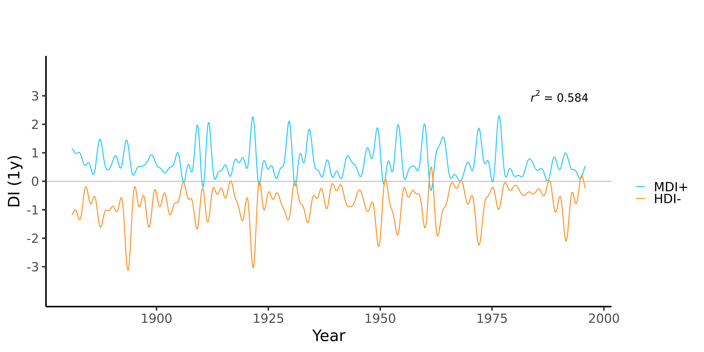<!-- -->


## Plot Historical Humidity Index (HHI)


```r
library("RColorBrewer")
mp2 <- ggplot() +
  theme_classic(base_size=80) +
  #theme_classic() +  
  scale_y_continuous(breaks=c(-3,-2,-1,0,1,2,3), limits=c(-4,4)) +
  labs(x="Year", y="HDI       HWI", title="", subtitle="") +
  geom_hline(aes(yintercept=0)) +
  geom_line(aes(y=hiFull$hwi5, x=hiFull$ts, color="a:HWI05"), size=1) +
  geom_line(aes(y=hiFull$hwi4, x=hiFull$ts, color="b:HWI04"), size=1.5) +
  geom_line(aes(y=hiFull$hwi3, x=hiFull$ts, color="c:HWI03"), size=2) +
  geom_line(aes(y=hiFull$hwi2, x=hiFull$ts, color="d:HWI02"), size=2.5) +
  geom_line(aes(y=hiFull$hwi1, x=hiFull$ts, color="e:HWI01"), size=3) +
  geom_line(aes(y=hiFull$hdi5, x=hiFull$ts, color="j:HDI05"), size=1) +  
  geom_line(aes(y=hiFull$hdi4, x=hiFull$ts, color="i:HDI04"), size=1.5) + 
  geom_line(aes(y=hiFull$hdi3, x=hiFull$ts, color="h:HDI03"), size=2) +  
  geom_line(aes(y=hiFull$hdi2, x=hiFull$ts, color="g:HDI02"), size=2.5) +  
  geom_line(aes(y=hiFull$hdi1, x=hiFull$ts, color="f:HDI01"), size=3) +
  scale_color_manual(
    name = "", 
    labels = c("HWI5", "HWI4", "HWI3", "HWI2", "HWI1",
               "HDI1", "HDI2", "HDI3", "HDI4", "HDI5"),
    breaks  = c("a:HWI05", "b:HWI04", "c:HWI03", "d:HWI02", "e:HWI01",
                "f:HDI01", "g:HDI02", "h:HDI03", "i:HDI04", "j:HDI05"),
    values = c("a:HWI05"="#005500",
               "b:HWI04"="#009933",               
               "c:HWI03"="#00ff00",               
               "d:HWI02"="#66ff99",               
               "e:HWI01"="#99ff99",
               "f:HDI01"="#ffffcc", 
               "g:HDI02"="#ffff11",                
               "h:HDI03"="#ff9900", 
               "i:HDI04"="#ff0000",                
               "j:HDI05"="#990000"                
               )
  ) + 
  theme( legend.key.width = unit(1,"cm")) 
mp2
```

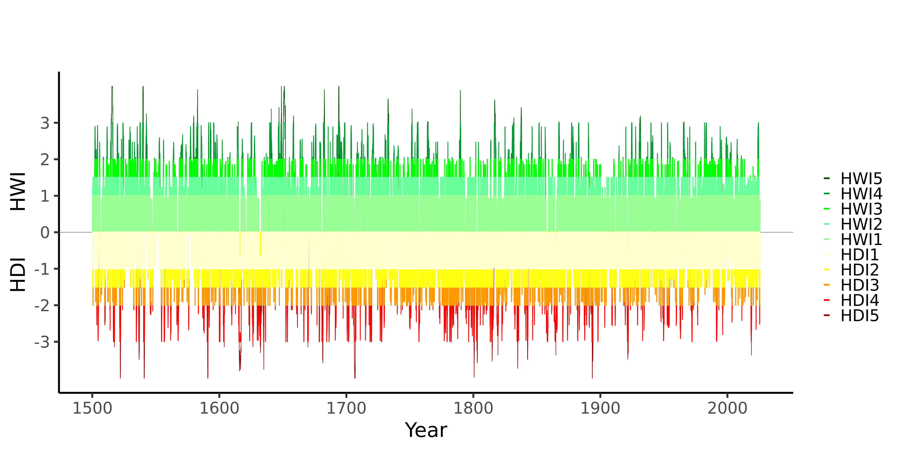<!-- -->

## Calculate Lowpass FFT of HHI


```r
pt1 <- hhi
pt1 <- pt1[order(pt1$ts),]
filterYears = 1.0   #filter 1y
pt1$prec1 <- do_fft(pt1$hhi,filterYears)
filterYears = 5.0   #filter 5y
pt1$prec5 <- do_fft(pt1$hhi,filterYears)
```


## Plot Historical Humidity Index


```r
library("RColorBrewer")
library("ggplot2")
hhiColors = brewer.pal(n = 9, name = "Spectral")
mp <- ggplot(pt1, aes())
mp + geom_raster(aes(year,month, fill=hhi))+
  geom_raster(aes(year,-1, fill=1.5*prec5))+
  geom_raster(aes(year,-2, fill=0.75*prec1))+
  #theme_classic() +
  theme_classic(base_size=80) +
  scale_y_continuous(breaks=c(-2,-1,1,6,12), lab=c("1y","5y","1","6","12"))+
  scale_x_continuous(limits=c(1500,endYear)) +  
  #scale_fill_gradient2(low="#AA6010", mid="#FCF0C2", high="#23AB30") +
  scale_fill_gradientn(colors=hhiColors) +  
  theme( legend.key.width = unit(2,"cm")) +
  guides(fill=guide_legend(title="HHI", reverse = TRUE)) +
  geom_hline(aes(yintercept = 6+0)) +
  geom_line(aes(y=6+2.5*pt1$prec5, x=pt1$ts, color="Filtered"), size=2.5) +
  scale_color_manual("Filtered", values=c("#000000"), labels=c("5y"))    
```

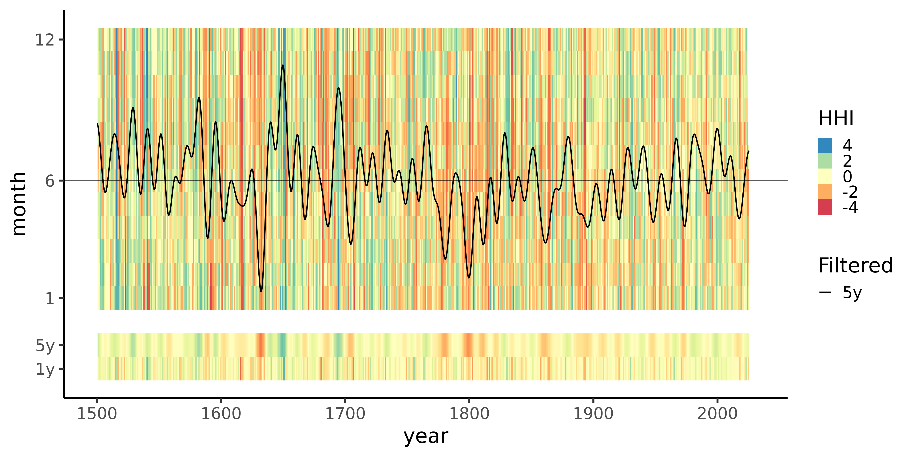<!-- -->

## Frequence Analysis of SPI

```r
pic <- hspi$spi1
len <- length(pic)
## mirror pic
pic <- append(pic, pic)
for(i in 1:len) {
  pic[i+len] <- pic[1+len-i]
}
frq <- fft(pic, inverse = FALSE)

breakYears=c(10,11,12,13,14,16,18,22,29,37,58,100,500)
breaksFreq=length(frq)/(12*breakYears)
labelsYears=lapply(breakYears, (function(year) substitute(frac(1, y), list(y=year)) ))
labelsYears=lapply(breakYears, (function(year) paste("1", year, sep="/") ))

filterYears = 5.0
start = round(len/(12*filterYears))
df <- data.frame(freq = 0:(start), amp = Mod(frq)[1:(start+1)])
df$labels <- length(frq)/(12*df$freq)
#subset(df, df$amp>1000)
ggplot(aes(), data=df) +
  theme_classic(base_size=80) +
  geom_segment(aes(y=df$amp, x=df$freq, xend = df$freq, yend = 0.0*df$amp), size=4) +
  xlab("frequency [1/y]") + ylab("amplitude") +
  #scale_x_continuous(breaks=c(0,10,20,30,40,50,60,70,80,90,100))
  scale_x_continuous(breaks=breaksFreq, lab=labelsYears)
```

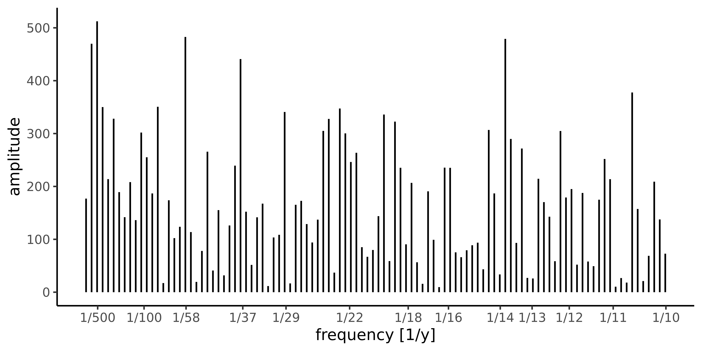<!-- -->


## Seasonal Trends of SPI (Winter)


```r
spi.apr <- subset(hspi, hspi$month == 4)   # w

apr.ts <- ts(spi.apr$spi6, frequency=58, start=c(1500,1))
apr.comp <- decompose(apr.ts)
plot(apr.comp)
```

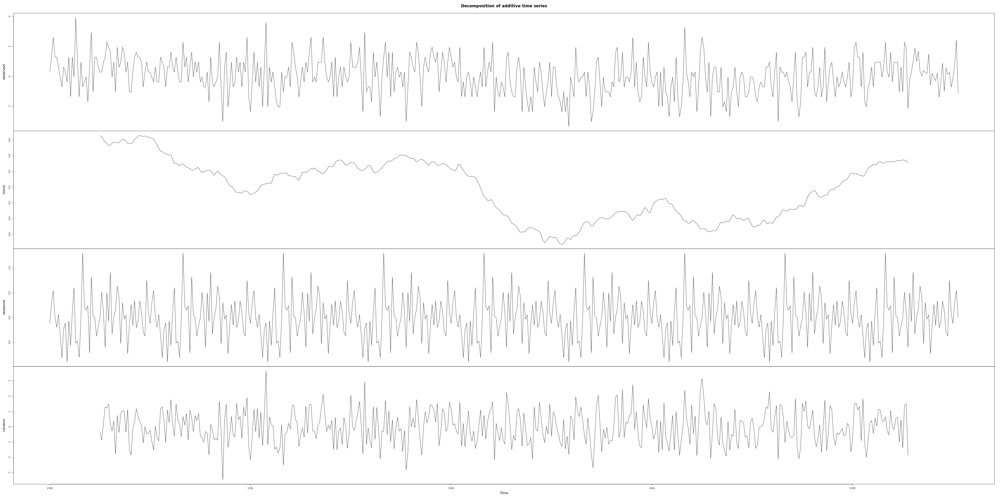<!-- -->

## Seasonal Trends of SPI (summer)


```r
spi.oct <- subset(hspi, hspi$month == 10)  # s

oct.ts <- ts(spi.oct$spi6, frequency=58, start=c(1500,1))
oct.comp <- decompose(oct.ts)
plot(oct.comp)
```

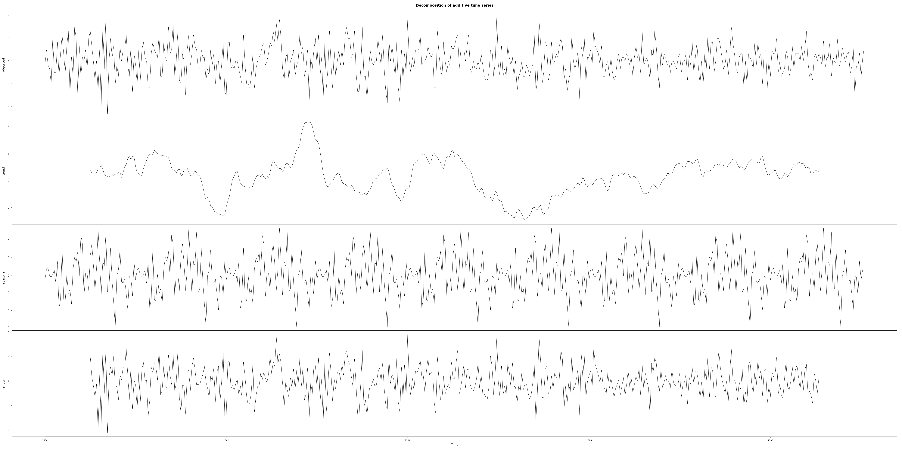<!-- -->

## Extract Single Drought Periods


```r
hhiLimit <- -0.5
filterYears <- 1/7  # ~2 month   ##  

## https://github.com/climdata/drought2019/blob/03a18c900d0000e2c98697764910b6b9f1bef32a/csv/hhi_1500_2xxx.csv
hhi_orig <- read.csv("https://raw.githubusercontent.com/climdata/drought2019/03a18c900d0000e2c98697764910b6b9f1bef32a/csv/hhi_1500_2xxx.csv", sep=",")


hhi_p <- pt1
#hhi_p <- hhi_orig

hhi_p$hhi.f <- do_fft(hhi_p$hhi,filterYears)
hhi_drought <- subset(hhi_p, hhi_p$hhi.f<hhiLimit)


hhi_drought <- hhi_drought[order(hhi_drought$ts),]

hhi_drought$n <- 0
hhi_drought$hhi.fmax  <- hhi_drought$hhi.f
hhi_drought$hhi.max   <- hhi_drought$hhi
hhi_drought$hhi.sum   <- hhi_drought$hhi
hhi_drought$hhi.avg   <- hhi_drought$hhi
hhi_drought$month.max <- hhi_drought$month
hhi_drought$year.max  <- hhi_drought$year
hhi_drought$ts.max  <- hhi_drought$ts
hhi_drought$ts.start  <- hhi_drought$ts
hhi_drought$ts.stop   <- hhi_drought$ts
hhi_drought$duration  <- 1
hhi_drought$maximum   <- FALSE

n <- 1
for(i in 2:nrow(hhi_drought)) {
      ## check if prevoius month
      if((hhi_drought$ts.start[i]-hhi_drought$ts.stop[i-1]) < 0.1) {
        hhi_drought$n[i] = n
        hhi_drought$n[i-1] = n
        #if(hhi_drought$hhi.fmax[i] < hhi_drought$hhi.fmax[i-1]) {
        if(hhi_drought$hhi.max[i] < hhi_drought$hhi.max[i-1]) {
          hhi_drought$month.max[i-1] <- hhi_drought$month.max[i]
          hhi_drought$year.max[i-1] <- hhi_drought$year.max[i]   
          hhi_drought$ts.max[i-1] <- hhi_drought$ts.max[i]             
          hhi_drought$maximum[i] <- TRUE
          hhi_drought$maximum[i-1] <- FALSE          
        } else {
          hhi_drought$month.max[i] <- hhi_drought$month.max[i-1]
          hhi_drought$year.max[i] <- hhi_drought$year.max[i-1]
          hhi_drought$ts.max[i] <- hhi_drought$ts.max[i-1]          
          #hhi_drought$maximum[i] <- FALSE
          #hhi_drought$maximum[i-1] <- TRUE           
        }
        hhi_drought$hhi.fmax[i] <- min(hhi_drought$hhi.fmax[i],hhi_drought$hhi.fmax[i-1])
        hhi_drought$hhi.max[i] <- min(hhi_drought$hhi.max[i],hhi_drought$hhi.max[i-1])
        hhi_drought$hhi.sum[i] <- (hhi_drought$hhi.sum[i] + hhi_drought$hhi.sum[i-1])
        hhi_drought$duration[i] <- (hhi_drought$duration[i] + hhi_drought$duration[i-1])
        hhi_drought$ts.start[i] <- min(hhi_drought$ts.start[i],hhi_drought$ts.start[i-1])
        hhi_drought$ts.stop[i]  <- max(hhi_drought$ts.stop[i],hhi_drought$ts.stop[i-1])
      } else {
        n <- n+1
        hhi_drought$n[i] = n
    }
}

for(i in nrow(hhi_drought):2) {
  if(hhi_drought$n[i] == hhi_drought$n[i-1]) {
    hhi_drought$hhi.fmax[i-1]  <- min(hhi_drought$hhi.fmax[i],hhi_drought$hhi.fmax[i-1])
    hhi_drought$hhi.max[i-1]   <- min(hhi_drought$hhi.max[i],hhi_drought$hhi.max[i-1])
    hhi_drought$month.max[i-1] <- hhi_drought$month.max[i]
    hhi_drought$year.max[i-1]  <- hhi_drought$year.max[i]
    hhi_drought$ts.max[i-1]  <- hhi_drought$ts.max[i]    
    hhi_drought$duration[i-1]  <- hhi_drought$duration[i]
    hhi_drought$ts.start[i-1]  <- hhi_drought$ts.start[i]
    hhi_drought$ts.stop[i-1]   <- hhi_drought$ts.stop[i]    
    hhi_drought$hhi.sum[i-1]   <- hhi_drought$hhi.sum[i]
    #if(hhi_drought$hhi.f[i-1] > hhi_drought$hhi.fmax[i]) {
    if(hhi_drought$hhi[i-1] > hhi_drought$hhi.max[i]) {
       hhi_drought$maximum[i-1] <- FALSE
    }
  }
}

hhi_drought$hhi.avg <- hhi_drought$hhi.sum / hhi_drought$duration

hhi_periods <- subset(hhi_drought, hhi_drought$maximum)
hhi_periods <- hhi_periods[order(hhi_periods$hhi.sum),]

drought_periods <- hhi_periods[,c('year','month','time', 'ts', 'hhi.fmax', 'hhi.max', 'hhi.sum', 'hhi.avg', 'duration', 'ts.start', 'ts.stop')]

write.table(drought_periods, file = "csv/droughts_1500_2xxx.csv", append = FALSE, quote = TRUE, sep = ",",
            eol = "\n", na = "NA", dec = ".", row.names = FALSE,
            col.names = TRUE, qmethod = "escape", fileEncoding = "UTF-8")
```

## Plot Single Drought Periods


```r
hhi_periods$hhi.cmax <- (1*hhi_periods$hhi.fmax + 2*hhi_periods$hhi.max)/3

droughtColors = brewer.pal(n = 5, name = "YlOrRd")

ggplot(data=hhi_periods, aes(y=-hhi.cmax, x=year, size=duration, color=-hhi.avg, label=year)) +
  theme_classic(base_size=80) +
  theme( legend.key.width = unit(2,"cm"), legend.key.height = unit(4,"cm")) +
  guides(fill=guide_legend(title="Droughts", reverse = TRUE)) +
  xlab("Year") + ylab("HHI min") +
  geom_text(alpha=0.8, check_overlap = FALSE)+
  scale_y_continuous(limits=c(0.1,4.2), breaks=c(0.5,1,1.5,2,2.5,3,3.5,4), labels=c('-0.5','-1.0','-1.5','-2.0','-2.5','-3.0','-3.5','-4.0'))+  
  scale_size(range = c(8, 28), name="Duration", trans="log", breaks=c(1,2,5,10,20))+
  scale_color_gradientn(colors=droughtColors, limits=c(0,4), name="HHI Ø", breaks=c(0,1,2,3,4))
```

<!-- -->

```r
ggplot(data=hhi_periods, aes(y=-hhi.cmax, x=year, size=duration, color=-hhi.avg, label=year)) +
  theme_classic(base_size=80) +
  theme( legend.key.width = unit(2,"cm"), legend.key.height = unit(4,"cm")) +
  guides(fill=guide_legend(title="Droughts", reverse = TRUE)) +
  xlab("Year") + ylab("HHI min") +
  geom_text(alpha=0.8, check_overlap = FALSE)+
  scale_y_continuous(limits=c(2.999,4.2), breaks=c(3,3.2,3.4,3.6,3.8,4,4.2), labels=c('-3.0','-3.2','-3.4','-3.6','-3.8','-4.0','-4.2'))+
  scale_size(range = c(8, 28), name="Duration", trans="log", breaks=c(1,2,5,10,20))+
  scale_color_gradientn(colors=droughtColors, limits=c(1,4), name="HHI Ø", breaks=c(0,1,2,3,4))
```

```
## Warning: Removed 335 rows containing missing values (geom_text).
```

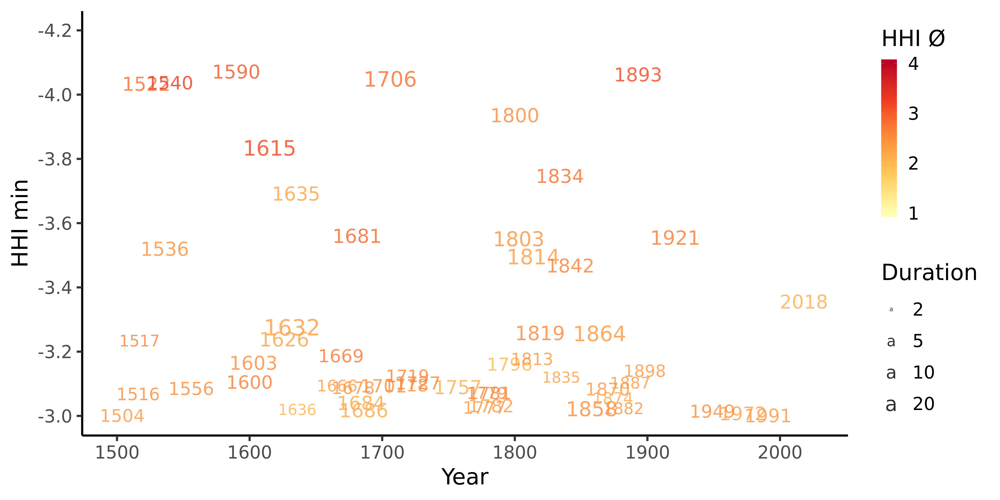<!-- -->

```r
#ggplot(data=hhi_periods, aes(y=-hhi.sum, x=year, size=-hhi.max, color=-hhi.avg, #label=year)) +
#  theme_classic(base_size=80) +
#  theme( legend.key.width = unit(2,"cm"), legend.key.height = unit(4,"cm")) +
#  guides(fill=guide_legend(title="Droughts", reverse = TRUE)) +
#  xlab("Year") + ylab("HHI sum") +
#  geom_text(alpha=0.8, check_overlap = FALSE)+
#  scale_y_continuous(trans="log", breaks=c(1,2,5,10,20,50,100))+
#  scale_size(range = c(8, 28), name="HHI max", breaks=c(0,1,2,3,4,5))+
#  scale_color_gradientn(colors=droughtColors, limits=c(0,4), name="HHI avg", #breaks=c(0,1,2,3,4))


mp <- ggplot(hhi_drought, aes(year.max, round(12*(ts+1/24))-round(6*(ts.start+ts.stop+1/12))))
mp + 
  #geom_raster(aes(fill=-hhi))+
  geom_tile(aes(fill=-hhi, width=1, height=1))+
  ##geom_tile(aes(x=txt_droughts$x+1402, y=16-txt_droughts$y, width=1, height=1, fill=6))+
  ##geom_tile(aes(x=txt_germany$x+1403, y=5-txt_germany$y, width=1, height=1, fill=4))+
  ##geom_tile(aes(x=txt_1500_2018$x+1401, y=-7-txt_1500_2018$y, width=1, height=1, fill=2))+
  ##geom_tile(aes(x=txt_qr$x+1460, y=15-txt_qr$y, width=1, height=1, fill=-1))+
  theme_classic(base_size=80) +
  #theme_classic() +
  labs(x="Year", y="Month", title="", subtitle="") +
  scale_y_continuous(breaks=c(-18,-12,-6,0,6,12,18), limits=c(-20,20))+
  scale_x_continuous(limits=c(1500,endYear)) +  
  scale_fill_gradientn(colors=droughtColors, limits=c(0,4)) + 
  theme( legend.key.width = unit(2,"cm")) +
  guides(fill=guide_legend(title="HHI", reverse = TRUE))
```

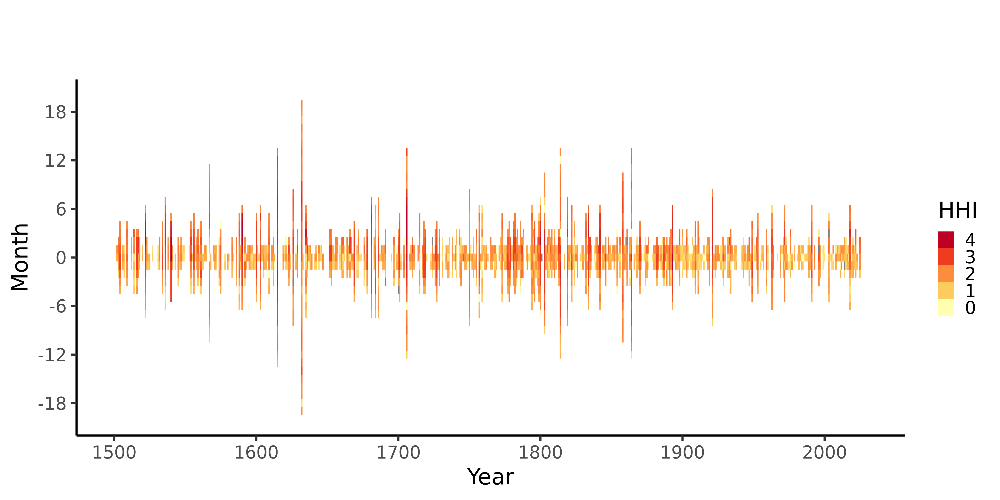<!-- -->

```r
mp <- ggplot(hhi_drought, aes(year.max, round(12*(ts+1/24))-round(12*(ts.start+1/24))))
mp + 
  #geom_raster(aes(fill=-hhi))+
  geom_tile(aes(fill=-hhi, width=1, height=1))+
  ##geom_tile(aes(x=txt_droughts$x+1402, y=16-txt_droughts$y, width=1, height=1, fill=6))+
  ##geom_tile(aes(x=txt_germany$x+1403, y=5-txt_germany$y, width=1, height=1, fill=4))+
  ##geom_tile(aes(x=txt_1500_2018$x+1401, y=-7-txt_1500_2018$y, width=1, height=1, fill=2))+
  ##geom_tile(aes(x=txt_qr$x+1460, y=15-txt_qr$y, width=1, height=1, fill=-1))+
  theme_classic(base_size=80) +
  #theme_classic() +
  labs(x="Year", y="Months", title="", subtitle="") +
  scale_y_continuous(breaks=c(-6,0,6,12,18,24,30,36,42), limits=c(-3,40))+
  scale_x_continuous(limits=c(1500,endYear)) +  
  scale_fill_gradientn(colors=droughtColors, limits=c(0,4)) + 
  theme( legend.key.width = unit(2,"cm")) +
  guides(fill=guide_legend(title="HHI", reverse = TRUE))
```

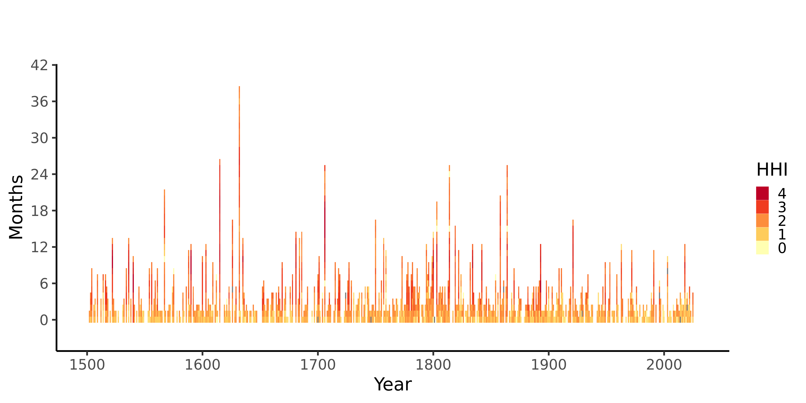<!-- -->

