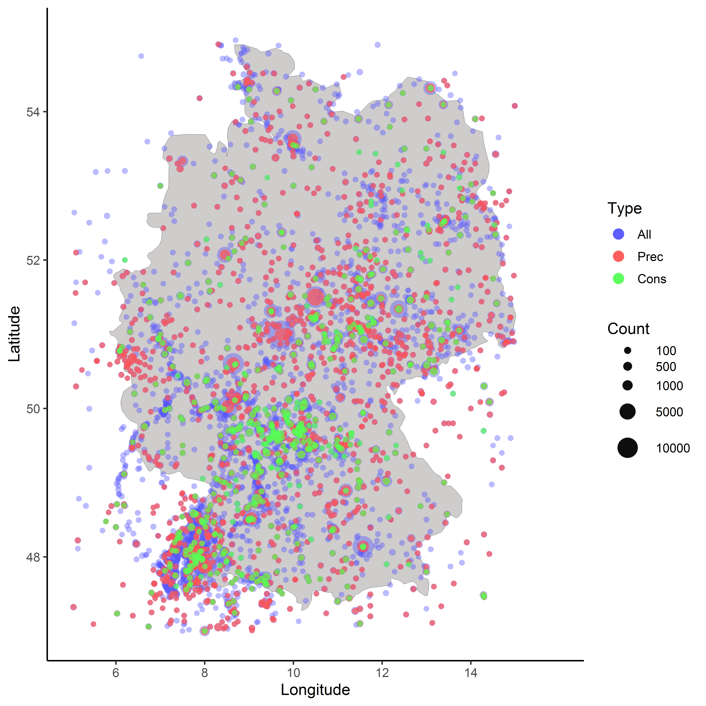
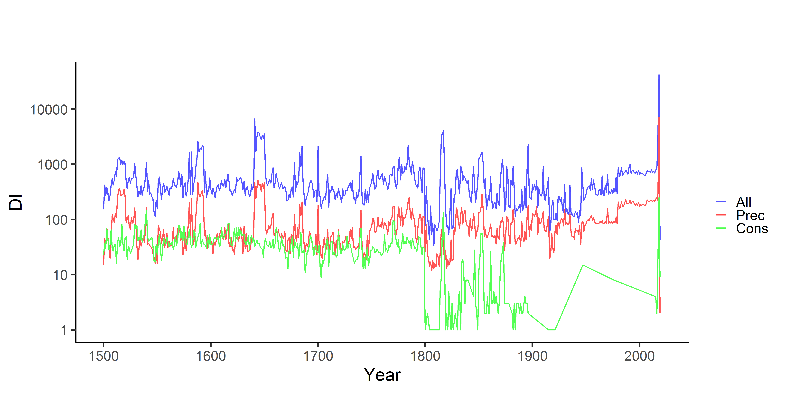

## Visualize tambora.org data related to droughts


```r
require("ggplot2")
```

```
## Loading required package: ggplot2
```

```
## Warning: package 'ggplot2' was built under R version 3.5.3
```

```r
require("extrafont")
```

```
## Loading required package: extrafont
```

```
## Warning: package 'extrafont' was built under R version 3.5.2
```

```
## Registering fonts with R
```

```r
require("ggmap")
```

```
## Loading required package: ggmap
```

```
## Warning: package 'ggmap' was built under R version 3.5.3
```

```
## Google's Terms of Service: https://cloud.google.com/maps-platform/terms/.
```

```
## Please cite ggmap if you use it! See citation("ggmap") for details.
```

```r
#require("rnaturalearth")
#require("rnaturalearthdata")
#require("sf")
#require("scales")


grp_all_de <- read.csv("csv/tmb_all_de_spat.csv", sep=";") 
grp_ns_de <- read.csv("csv/tmb_ns_de_spat.csv", sep=";") 
grp_cs_de <- read.csv("csv/tmb_cons_de_spat.csv", sep=";") 

sum(grp_all_de$count)
```

```
## [1] 336927
```

```r
sum(grp_ns_de$count)
```

```
## [1] 54248
```

```r
sum(grp_cs_de$count)
```

```
## [1] 12673
```

```r
mapWorld <- borders("world", colour="#000000", fill="#CFCCCC", xlim = c(10, 11), ylim = c(50, 51))

mp <- ggplot() +   mapWorld
mp <- mp +
  geom_point(aes(x=grp_all_de$longitude, y=grp_all_de$latitude, size=(grp_all_de$count), color="All"), alpha=0.4, shape=20)+
  geom_point(aes(x=grp_ns_de$longitude, y=grp_ns_de$latitude, size=(grp_ns_de$count), color="Prec"), alpha=0.7, shape=20)+
  geom_point(aes(x=grp_cs_de$longitude, y=grp_cs_de$latitude, size=(grp_cs_de$count), color="Cons"), alpha=0.7, shape=20)+
  scale_size_area(trans="sqrt") + 
  labs(fill="")+
  #theme_classic() +
  theme_classic(base_size=80) +
  xlab("Longitude") + ylab("Latitude") +
  guides(colour = guide_legend(override.aes = list(size=40))) +
  scale_x_continuous(limits=c(5,16), breaks=c(6,8,10,12,14)) +  
  scale_y_continuous(limits=c(47,55), breaks=c(48,50,52,54)) +
  
  scale_color_manual(
    name = "Type", 
    labels = c("All", "Prec", "Cons"),
    breaks  = c("All", "Prec", "Cons"),
    values = c("All"="#5555FF", "Prec"="#FF5555", "Cons"="#55FF55")              
    ) +
   scale_size_continuous( range = c(20, 100), breaks=c(100,500,1000,5000,10000), name="Count")
```

```
## Scale for 'size' is already present. Adding another scale for 'size', which
## will replace the existing scale.
```

```r
mp  
```

```
## Warning: Removed 134 rows containing missing values (geom_point).
```

```
## Warning: Removed 67 rows containing missing values (geom_point).
```

```
## Warning: Removed 15 rows containing missing values (geom_point).
```

<!-- -->

## Temporal


```r
tmp_all_de <- read.csv("csv/tmb_all_de_temp.csv", sep=";") 
tmp_ns_de <- read.csv("csv/tmb_ns_de_temp.csv", sep=";") 
tmp_cs_de <- read.csv("csv/tmb_cons_de_temp.csv", sep=";") 

mp1 <- ggplot() +
  theme_classic(base_size=80) +
  #theme_classic() +
  #coord_cartesian(ylim=c(-4,4)) +
  #scale_y_continuous(limits=c(0,8000)) +
  scale_y_log10() +
  scale_x_continuous(breaks=c(1500,1600,1700,1800,1900,2000), limits=c(1500,2020)) +
  labs(x="Year", y="DI", title="", subtitle="") +
  #geom_hline(aes(yintercept=0)) +
  geom_line(aes(y=tmp_all_de$count, x=tmp_all_de$year, color="All"), size=2.5) +
  geom_line(aes(y=tmp_ns_de$count, x=tmp_ns_de$year, color="Prec"), size=2.5) +
  geom_line(aes(y=tmp_cs_de$count, x=tmp_cs_de$year, color="Cons"), size=2.5) +  
  #annotate('text', x = 1990, y = 3.0, label = eq, parse = TRUE, size=20) +
  scale_color_manual(
    name = "", 
    labels = c("All", "Prec", "Cons"),
    breaks  = c("All", "Prec", "Cons"),
    values = c("All"="#5555FF", "Prec"="#FF5555", "Cons"="#55FF55")              
    ) +  
  theme( legend.key.width = unit(2,"cm")) 
mp1
```

<!-- -->

